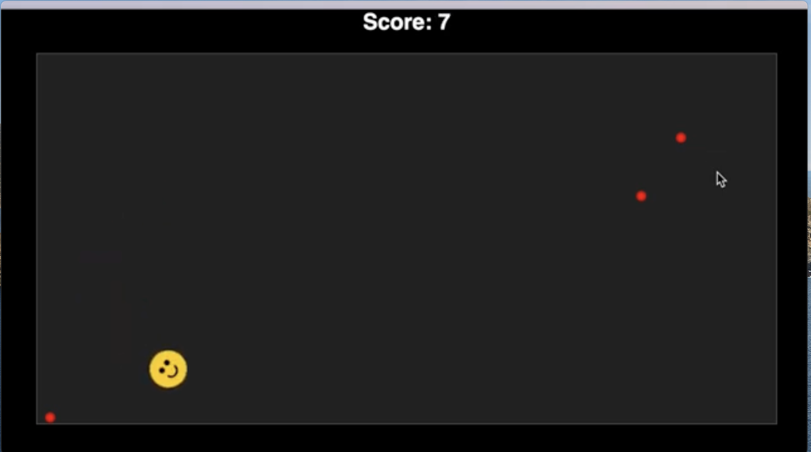

# Kolobok AI Game

A browser-based game featuring Kolobok, an AI-controlled character that autonomously collects food pellets.

## Features

- AI-controlled character with automatic pathfinding
- Score tracking and win condition
- Smooth animations and collision detection
- Built with vanilla JavaScript and HTML5 Canvas
- No dependencies required

## How to Play

1. Open `index.html` in a web browser
2. Watch Kolobok (yellow circle) collect red pellets
3. Game is won when all pellets are collected, watch AI work its magic

## Getting Started

```bash
git clone https://github.com/paractmol/kolobok.git
cd kolobok
# Open index.html in your browser
```

Compatible with all modern browsers (Chrome, Firefox, Safari, Edge)

## Demo



https://youtu.be/XrYT-vb7gLU

## Credits

Generated with the assistance of OpenAI O1 model